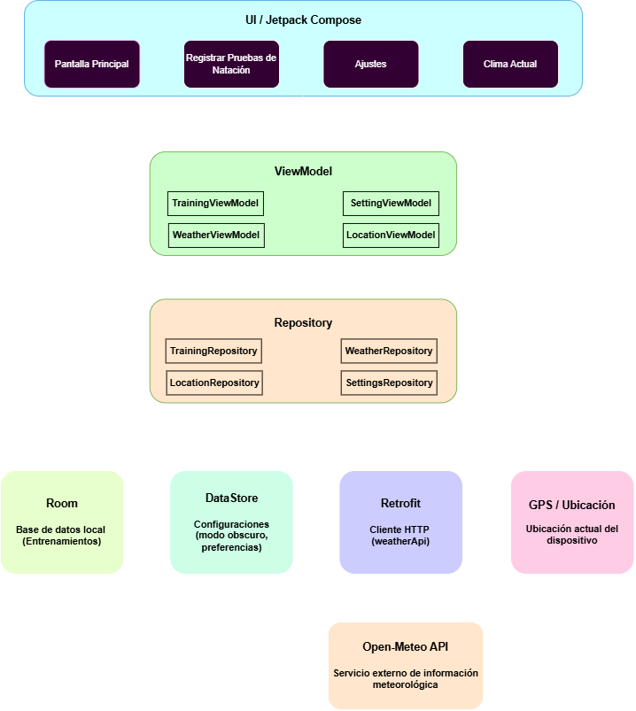
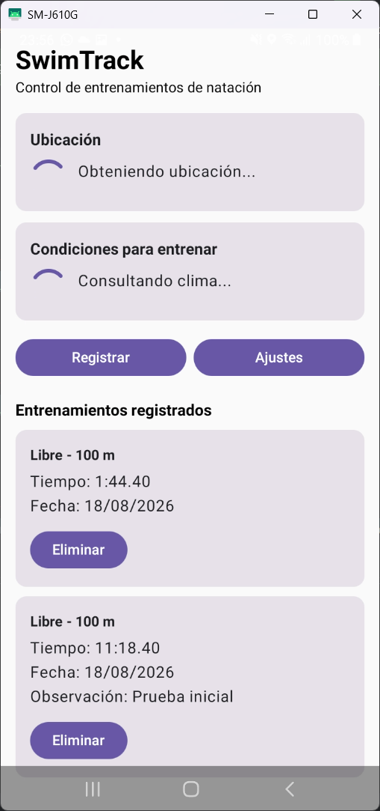
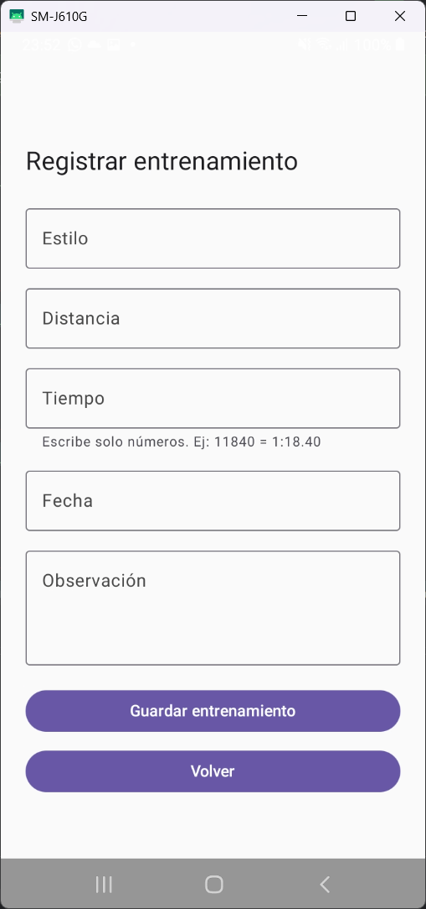
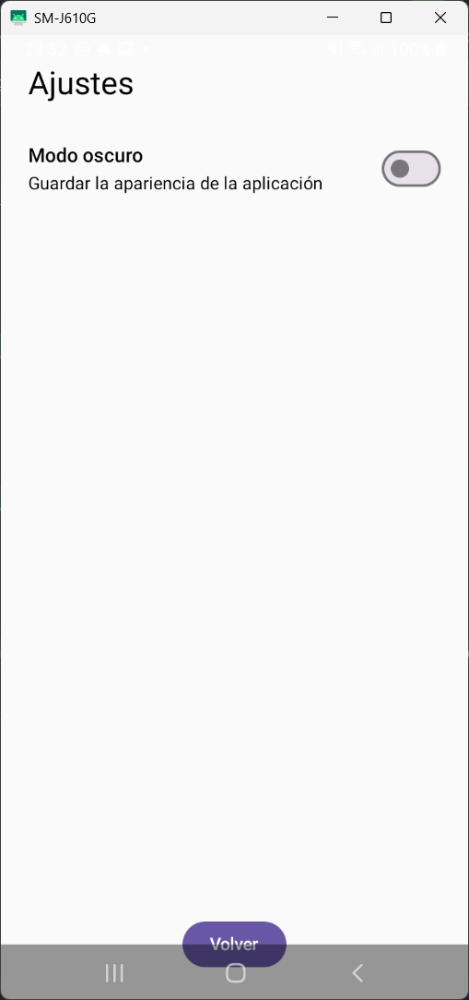
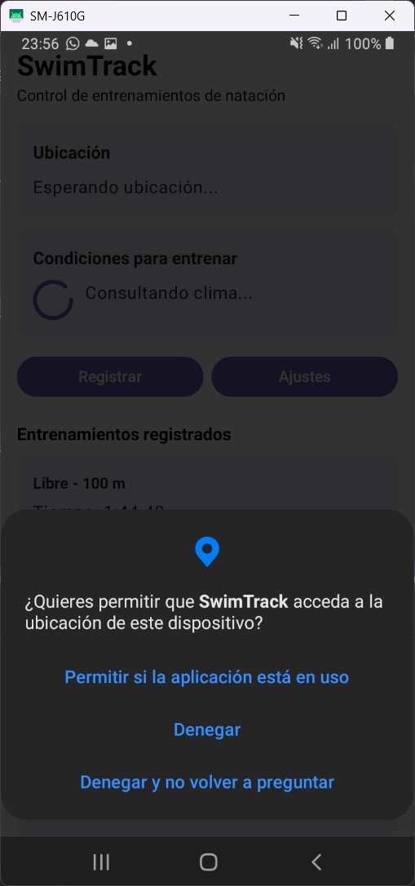
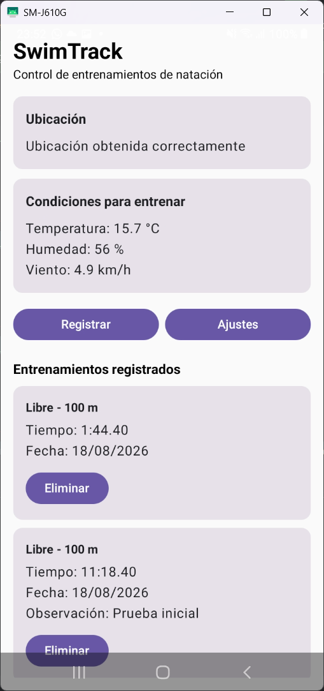

# SwimTrack

## Descripción

SwimTrack es una aplicación móvil Android desarrollada con Kotlin y Jetpack Compose para registrar y consultar entrenamientos de natación.

La aplicación permite almacenar información básica de cada entrenamiento, como el estilo de natación, la distancia, el tiempo realizado, la fecha y una observación opcional.

Además, integra información meteorológica obtenida desde Internet utilizando la ubicación actual del dispositivo, permitiendo consultar condiciones como temperatura, humedad y velocidad del viento.

El proyecto fue desarrollado como parte del proyecto final de la asignatura de Aplicaciones Móviles.

---

## Funcionalidades principales

* Registro de entrenamientos de natación.
* Visualización de entrenamientos registrados.
* Eliminación de registros.
* Persistencia local de entrenamientos mediante Room.
* Modo oscuro configurable.
* Persistencia del modo oscuro mediante DataStore.
* Consulta de información meteorológica mediante una API REST.
* Obtención de la ubicación actual del dispositivo.
* Solicitud de permisos de ubicación en tiempo de ejecución.
* Manejo del caso en que el usuario rechaza el permiso de ubicación.
* Manejo de estados de carga, éxito y error al consumir la API.
* Navegación entre diferentes pantallas utilizando Navigation Compose.

---

## Pantallas de la aplicación

La aplicación cuenta con las siguientes pantallas principales:

### Inicio

Muestra:

* condiciones meteorológicas de la ubicación actual;
* estado de la ubicación;
* accesos para registrar entrenamientos y abrir los ajustes;
* lista de entrenamientos registrados.

### Registrar entrenamiento

Permite ingresar:

* estilo de natación;
* distancia;
* tiempo;
* fecha;
* observación.

Los datos registrados se almacenan localmente utilizando Room.

### Ajustes

Permite activar o desactivar el modo oscuro.

La preferencia seleccionada permanece guardada mediante DataStore incluso después de cerrar la aplicación.

---

## Arquitectura

SwimTrack utiliza una arquitectura basada en MVVM y Repository.

La estructura principal es:

```text
UI
↓
ViewModel
↓
Repository
↓
Fuentes de datos
```

Las fuentes de datos utilizadas son:

```text
Room
DataStore
Retrofit
GPS / ubicación
```

El flujo general puede representarse de la siguiente manera:

```text
Jetpack Compose
      ↓
   ViewModel
      ↓
  Repository
   ↙   ↓    ↘
Room DataStore Retrofit
                 ↓
             Open-Meteo

Ubicación del dispositivo
          ↓
LocationRepository
          ↓
WeatherViewModel
          ↓
Open-Meteo
```

Esta separación permite que la interfaz no acceda directamente a Room, Retrofit o los servicios de ubicación.

---

## Estructura del proyecto

```text
com.example.swimtrack
│
├── data
│   ├── local
│   │   ├── SwimTrackDatabase
│   │   ├── TrainingDao
│   │   └── TrainingEntity
│   │
│   ├── preferences
│   │   └── UserPreferencesRepository
│   │
│   └── remote
│       ├── RetrofitInstance
│       ├── WeatherApi
│       └── WeatherResponse
│
├── repository
│   ├── TrainingRepository
│   ├── WeatherRepository
│   └── LocationRepository
│
├── viewmodel
│   ├── TrainingViewModel
│   ├── SettingsViewModel
│   ├── WeatherViewModel
│   └── LocationViewModel
│
├── navigation
│   └── AppNavigation
│
├── ui
│   ├── screens
│   └── theme
│
└── MainActivity
```

## Diagrama de arquitectura

El siguiente diagrama representa la arquitectura general utilizada en SwimTrack y la relación entre la interfaz, los ViewModel, los Repository y las diferentes fuentes de datos.



---

## Tecnologías utilizadas

* Kotlin
* Android Studio
* Jetpack Compose
* Navigation Compose
* MVVM
* Repository Pattern
* Room
* DataStore
* Retrofit
* Gson
* Kotlin Coroutines
* Flow
* StateFlow
* Google Play Services Location
* GPS / ubicación
* Git
* GitHub

---

## Persistencia local

### Room

Room se utiliza para almacenar los entrenamientos registrados por el usuario.

Cada entrenamiento contiene información como:

* estilo;
* distancia;
* tiempo;
* fecha;
* observación.

Los datos permanecen almacenados incluso después de cerrar la aplicación.

### DataStore

DataStore se utiliza para guardar una preferencia simple del usuario: el modo oscuro.

Cuando el usuario activa o desactiva esta opción, el valor queda almacenado y se recupera automáticamente al volver a abrir la aplicación.

---

## API REST utilizada

La aplicación utiliza la API pública de Open-Meteo para consultar información meteorológica.

Los datos mostrados incluyen:

* temperatura actual;
* humedad relativa;
* velocidad del viento.

La aplicación obtiene primero la ubicación del dispositivo y utiliza sus coordenadas para consultar el clima correspondiente a esa zona.

---

## Retrofit

Retrofit se utiliza como cliente HTTP para comunicarse con la API REST.

La aplicación maneja tres estados principales:

### Cargando

Se muestra mientras se espera la respuesta del servidor.

### Éxito

Se muestran los datos meteorológicos obtenidos.

### Error

Se muestra un mensaje cuando ocurre un problema, por ejemplo cuando no existe conexión a Internet.

El usuario también puede intentar nuevamente la consulta.

---

## GPS y permisos

SwimTrack utiliza la ubicación del dispositivo para consultar las condiciones meteorológicas de la zona actual.

La aplicación solicita los permisos de ubicación en tiempo de ejecución.

Se manejan diferentes situaciones:

* permiso concedido;
* permiso rechazado;
* ubicación del teléfono desactivada;
* ubicación obtenida correctamente.

Si el usuario rechaza el permiso, la aplicación muestra un mensaje explicativo y permite volver a solicitarlo.

---

## Interfaz de usuario

La interfaz fue desarrollada completamente con Jetpack Compose.

Se utilizaron componentes como:

* `Column`;
* `Row`;
* `Card`;
* `Button`;
* `Text`;
* `Switch`;
* `LazyColumn`;
* `CircularProgressIndicator`.

La interfaz también responde automáticamente a los cambios producidos en los `StateFlow` de los ViewModel.

---

## Navegación

La aplicación utiliza Navigation Compose para desplazarse entre las diferentes pantallas.

El flujo principal es:

```text
Inicio
├── Registrar entrenamiento
└── Ajustes
```

---

## Manejo de estados

SwimTrack utiliza `Flow` y `StateFlow` para mantener una interfaz reactiva.

Por ejemplo, el consumo de la API meteorológica utiliza los estados:

```text
Loading
Success
Error
```

La ubicación utiliza estados similares:

```text
Idle
Loading
Success
Error
```

Esto permite que Jetpack Compose actualice automáticamente la pantalla cuando cambia el estado de los datos.

---

## Corrutinas

Las operaciones asíncronas se realizan utilizando Kotlin Coroutines.

Los ViewModel utilizan:

```kotlin
viewModelScope.launch
```

para ejecutar operaciones sin bloquear la interfaz de usuario.

---

## Compilación y despliegue

Se generaron los siguientes archivos para la entrega:

```text
APK
```

para instalación directa y pruebas.

También se generó:

```text
AAB firmado
```

listo para utilizarse en Google Play Store.

No es necesario publicar la aplicación en Play Store para este proyecto.

---

## Capturas de pantalla

### Pantalla principal



### Registro de entrenamiento



### Ajustes



### Permiso de ubicación



### Información meteorológica



---

## Autor

Alejandro Coral

Proyecto Final de la asignatura de Aplicaciones Móviles.
